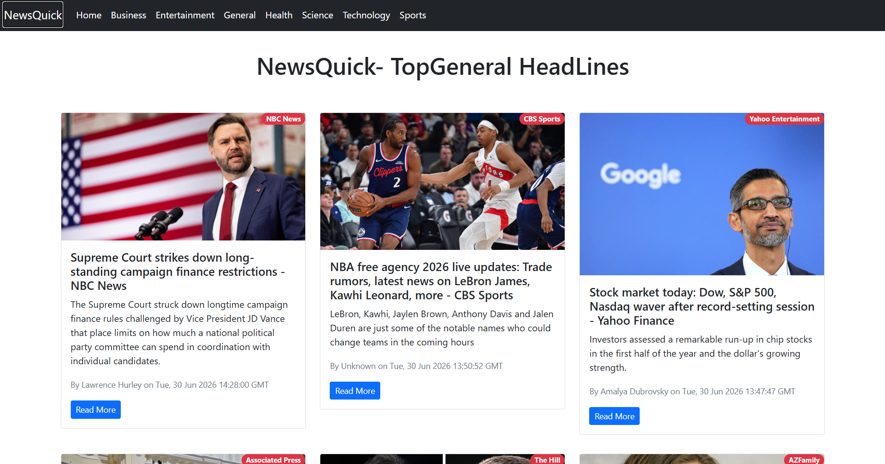

# NewsQuick 📰

NewsQuick is a responsive React-based news web application that delivers real-time top headlines from various categories such as Business, Entertainment, Health, Science, Sports, Technology, and General News. The application uses NewsAPI to fetch the latest news and provides an intuitive browsing experience with infinite scrolling.

## Features

* Browse top headlines across multiple categories
* Real-time news updates using NewsAPI
* Infinite scrolling for seamless content loading
* Responsive design for desktop and mobile devices
* Category-based navigation
* Loading progress indicator
* Clean and user-friendly interface

## Tech Stack

* React.js
* React Router DOM
* Bootstrap
* NewsAPI
* React Infinite Scroll Component
* React Top Loading Bar

## Installation

1. Clone the repository:

```bash
git clone <repository-url>
```

2. Navigate to the project directory:

```bash
cd NewsQuick
```

3. Install dependencies:

```bash
npm install
```

4. Create a `.env` file in the root directory and add your NewsAPI key:

```env
REACT_APP_NEWS_API=YOUR_API_KEY
```

5. Start the development server:

```bash
npm start
```

The application will run on:

```text
http://localhost:3000
```

## Project Structure

```text
src/
├── Components/
│   ├── Navbar.js
│   ├── News.js
│   ├── NewsItem.js
│   └── Spinner.js
├── App.js
├── App.css
└── index.js
```

## Categories Available

* General
* Business
* Entertainment
* Health
* Science
* Sports
* Technology

## Screenshots

### Home Page



